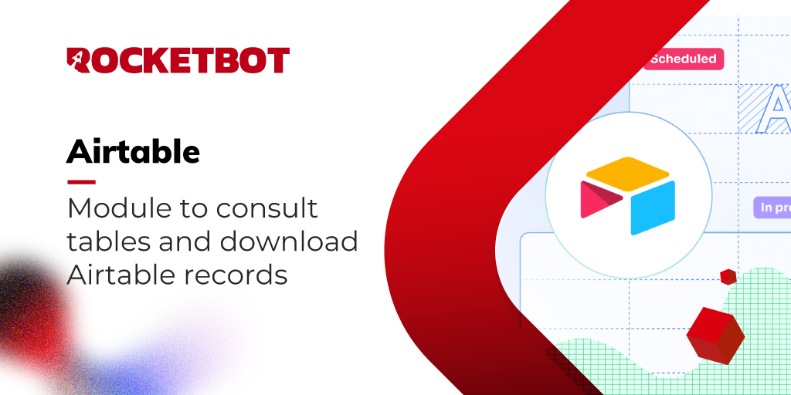

# Airtable
  
Módulo para interactuar con Airtable, consultar tablas y descargar registros  

## Como usar este módulo

Para loguearse y mantener su sesión activa de Airtable necesita crear un Token de Acceso Personal.
1. Desde /create/tokens, haz clic en el botón "Crear nuevo token" para crear un nuevo token de acceso personal.

2. Dale a tu token un nombre único. Este nombre será visible en el historial de revisión de registros.

3. Elija los alcances para otorgar su token. Esto controla qué puntos finales de API podrá usar el token.

4. Haga clic en "agregar una base" para otorgar acceso al token a una base o espacio de trabajo. Puede otorgar acceso a cualquier combinación y número de bases y espacios de trabajo. También puede otorgar acceso a todos los espacios de trabajo y bases de su cuenta. Tenga en cuenta que el token solo podrá leer y escribir datos dentro de las bases y espacios de trabajo que le hayan sido asignados.

5. Una vez creado su token, solo se lo mostraremos una vez, por lo que le recomendamos que lo copie en su portapapeles y lo guarde en un lugar seguro. Si bien podrá administrarlo en /create/tokens, el token confidencial en sí no se almacena por motivos de seguridad.

Si es administrador empresarial, también puede crear un token de acceso personal para una cuenta de servicio desde el Panel de administración; consulte este artículo de soporte para obtener más detalles: https://support.airtable.com/docs/service-accounts-overview?_gl=1

## Como instalar este módulo
  
Para instalar el módulo en Rocketbot Studio, se puede hacer de dos formas:
1. Manual: __Descargar__ el archivo .zip y descomprimirlo en la carpeta modules. El nombre de la carpeta debe ser el mismo al del módulo y dentro debe tener los siguientes archivos y carpetas: \__init__.py, package.json, docs, example y libs. Si tiene abierta la aplicación, refresca el navegador para poder utilizar el nuevo modulo.
2. Automática: Al ingresar a Rocketbot Studio sobre el margen derecho encontrara la sección de **Addons**, seleccionar **Install Mods**, buscar el modulo deseado y presionar install.  

## Descripción de los comandos

### Login
  
Guarda una sesión y lista las base de datos disponibles
|Parámetros|Descripción|ejemplo|
| --- | --- | --- |
|Token de acceso personal|Token creado en la seccion create/tokens de Airtable|patSE7khj3MXjcByw.2a92ada817d7e3d9e9bbe|
|Session|Identificador de sesión (Opcional)|session|
|Variable|Variable donde se guardará el resultado|res|

### Listar Tablas
  
Obtiene una lista con el nombre y id de las tablas que estén en la base de datos elegida
|Parámetros|Descripción|ejemplo|
| --- | --- | --- |
|ID de la Base de Datos|ID de la base de datos obtenido del comando login|app6OeOEMw1btcZ9s|
|Session|Identificador de sesión (Opcional)|session|
|Variable|Variable donde se guardará el resultado|res|

### Obtener Registros
  
Obtiene los registros de una tabla
|Parámetros|Descripción|ejemplo|
| --- | --- | --- |
|ID de la Base de Datos|ID de la base de datos obtenido del comando login|app6OeOEMw1btcZ9s|
|ID de la Tabla|ID de la Tabla obtenido del comando listar tablas|tbl9ULBsFxuSU8aLF|
|Filtro|Fórmula de filtrado para obtener los registros. Los campos van entre llaves. Para más información revisa la documentación https//support.airtable.com/docs/formula-field-reference|{Estado}='Todo'|
|Vista|Vista ocupada tal cual como está escrita en la app, los registros serán obtenidos en ese orden|Grid|
|Número de Registros|Número de Registros a traer por solicitud si se quieren 100 o menos de 100. No usar si se quieren traer todos los registros. Debe ingresar un número entero del 1 al 100|100|
|Session|Identificador de sesión (Opcional)|session|
|Variable|Variable donde se guardará el resultado|res|

### Descargar CSV
  
Exporta como csv los registros obtenidos
|Parámetros|Descripción|ejemplo|
| --- | --- | --- |
|Registro|Diccionario con los registros obtenidos con el comando 'Listar Registros'|{registros}|
|Url de descarga|URL donde se descargará el archivo csv, incluir nombre y extensión del archivo|C:\users\usuario\Downloads\registro.csv|
|Session|Identificador de sesión (Opcional)|session|
|Variable|Variable donde se guardará el resultado|res|
