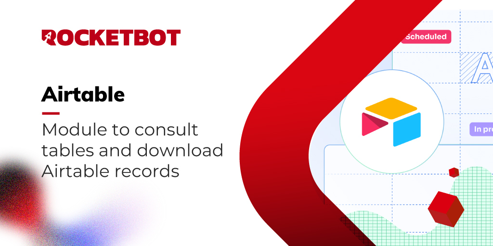

# Airtable
  
Módulo para interagir com Airtable, consultar tabelas e baixar registros  

## Como usar este módulo

Para fazer login e manter sua sessão Airtable ativa, você precisa criar um token de acesso pessoal.
1. Em /create/tokens, clique no botão “Criar novo token” para criar um novo token de acesso pessoal.

2. Dê um nome exclusivo ao seu token. Este nome ficará visível no histórico de revisão de registros.

3. Escolha os escopos a serem concedidos ao seu token. Isso controla quais endpoints de API o token poderá usar.

4. Clique em ‘adicionar uma base’ para conceder ao token acesso a uma base ou espaço de trabalho. Você pode conceder acesso a qualquer combinação e número de bases e espaços de trabalho. Você também pode conceder acesso a todos os espaços de trabalho e bases da sua conta. Lembre-se de que o token só poderá ler e gravar dados nas bases e espaços de trabalho que lhe foram atribuídos.

5. Depois que seu token for criado, nós o mostraremos apenas uma vez, por isso recomendamos que você o copie para sua área de transferência e armazene-o em algum lugar seguro. Embora você possa gerenciá-lo em /create/tokens, o token confidencial em si não é armazenado por motivos de segurança.

Se você for um administrador corporativo, também poderá criar um token de acesso pessoal para uma conta de serviço no Painel de administração. Consulte este artigo de suporte para obter detalhes: https://support.airtable.com/docs/service-accounts-overview? _gl=1

## Como instalar este módulo
  
Para instalar o módulo no Rocketbot Studio, pode ser feito de duas formas:
1. Manual: __Baixe__ o arquivo .zip e descompacte-o na pasta módulos. O nome da pasta deve ser o mesmo do módulo e dentro dela devem ter os seguintes arquivos e pastas: \__init__.py, package.json, docs, example e libs. Se você tiver o aplicativo aberto, atualize seu navegador para poder usar o novo módulo.
2. Automático: Ao entrar no Rocketbot Studio na margem direita você encontrará a seção **Addons**, selecione **Install Mods**, procure o módulo desejado e aperte instalar.  

## Descrição do comando

### Login
  
Salva uma sessão e lista os bancos de dados disponíveis.
|Parâmetros|Descrição|exemplo|
| --- | --- | --- |
|Token de acesso pessoal|Token criado na seção create/tokens do Airtable|patSE7khj3MXjcByw.2a92ada817d7e3d9e9bbe|
|Session|ID da sessão (Opcional)|session|
|Variável|Variável onde o resultado será salvo|res|

### Listar tabelas
  
Obtém uma lista com o nome e id das tabelas que estão no banco de dados escolhido
|Parâmetros|Descrição|exemplo|
| --- | --- | --- |
|ID do banco de dados|ID do banco de dados obtido do comando de login|app6OeOEMw1btcZ9s|
|Session|ID da sessão (Opcional)|session|
|Variável|Variável onde o resultado será salvo|res|

### Obtener Registros
  
Obtenha registros de uma tabela
|Parâmetros|Descrição|exemplo|
| --- | --- | --- |
|ID do banco de dados|ID do banco de dados obtido do comando de login|app6OeOEMw1btcZ9s|
|ID do Tabela|ID da tabela obtido a partir do comando listar tabelas|tbl9ULBsFxuSU8aLF|
|Filtro|Fórmula de filtragem para obter os registros. Os campos estão entre colchetes. Para mais informações consulte a documentação https//support.airtable.com/docs/formula-field-reference|{Estado}='Todo'|
|Vista|Visualização ocupada conforme escrito no aplicativo, os registros serão obtidos nessa ordem|Grid|
|Número de registros|Número de registros a serem trazidos por solicitação se quiser 100 ou menos que 100. Não use se quiser trazer todos os registros. Você deve inserir um número inteiro de 1 a 100|100|
|Session|ID da sessão (Opcional)|session|
|Variável|Variável onde o resultado será salvo|res|

### Baixar CSV
  
Exporte os registros obtidos como csv
|Parâmetros|Descrição|exemplo|
| --- | --- | --- |
|Registro|Dicionário com os registros obtidos com o comando 'Listar Registros'|{registros}|
|Caminho da descarga|URL onde o arquivo csv será baixado, incluindo nome e extensão do arquivo|C:\users\usuario\Downloads\registro.csv|
|Session|ID da sessão (Opcional)|session|
|Variável|Variável onde o resultado será salvo|res|
